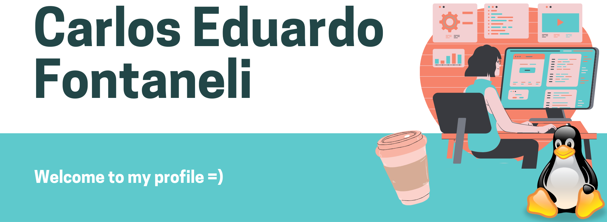
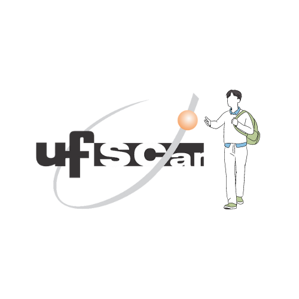
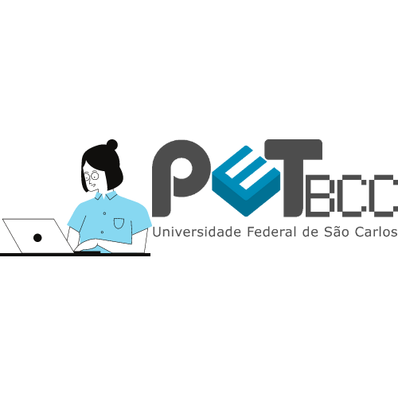

# 👨 About me:

Atualmente sou um graduando em Bacharelado em Ciência da Computação pela Universidade Federal de São Carlos(UFSCar). Durante a graduação fiz parte como bolsista do grupo Programa de Educação e Tutoria - Bacharelado em Ciência da Computação
tive a oportunidade de aprender a trabalhar em equipe, melhorar minha comunicação e liderança de projetos. Além disso, tive contato com prototipação de telas e aplicativos, desenvolvimento web e mobile, e trabalhei com tecnologias como Git, Python e C.
 
Além disso, fiz parte, também como bolsista, do Projeto Integrador Extensionista - ¨Implementando a análise automática de dados do sistema Consulta Pública¨ trabalhei com Aprendizado de Máquina, com foco em modelos de Processamento de Linguagem Natural. Os modelos desenvolvidos buscavam extrair sentimentos de textos de consultas públicas. Ademais, fiz parte do desenvolvimento de API’s na AWS que buscavam utilizar os modelos criados para realizar uma análise automatizada dos dados. Dessa forma, tive muito contato com modelos estatísticos e Python, além de um contato inicial com FastApi, Docker e Javascript.
 
A área a qual tenho mais interesse e pretendo seguir como atuação profissional é o campo de Ciência de Dados. Tenho tido bastante contato na graduação com técnicas de visualização, tratamento e análise de dados.
 
Gosto bastante de estudar sobre modelos de aprendizado de máquina e como eles podem ser usados para predizer comportamento ou extrair padrões. Durante a graduação estou estudando diversas técnicas de aprendizado de máquina tanto supervisionado quanto não supervisionado. Dessa forma, fiz projetos que usavam modelos preditivos como Gaussian Naive Bayes e modelos de agrupamento como KMeans e agrupamento hierárquico.
 
(I am currently a Bachelor's degree student in Computer Science at the Federal University of São Carlos (UFSCar). During graduation I was part of the Education and Tutoring Program group - Bachelor of Computer Science I had the opportunity to learn how to work in a team, improve my communication and project leadership. Furthermore, I had contact with screen and application prototyping, web and mobile development, and worked with technologies such as Git, Python and C.
 
Also, I was part, also as a scholarship holder, of the Extensionist Integrator Project - ¨Implementing automatic data analysis of the Public Consultation system¨ I worked with Machine Learning, focusing on Natural Language Processing models. The developed models sought to extract feelings from public consultation texts. In addition, I was part of the development of APIs on AWS that sought to use the models created to perform an automated analysis of the data. In this way, I had a lot of contact with statistical models and Python, in addition to an initial contact with FastApi, Docker and Javascript.
 
The area in which I am most interested and intend to pursue as a professional activity is the field of Data Science. I have had a lot of contact in graduation with visualization techniques, treatment and data analysis.
 
I really enjoy learning about machine learning models and how they can be used to predict behavior or extract patterns. During graduation I'm studying several machine learning techniques both supervised and unsupervised. So I've done projects that used predictive models like Gaussian Naive Bayes and clustering models like KMeans and hierarchical clustering.)

  
  

# 📱 My contacts:

Caso você queira me contatar, sinta-se a vontade para me enviar mensagens através dos seguintes links:
 
(In case you have interest in talk to me, be welcome to send me messages by the below social medias:)

 
   
  
   
   

# 🧰 Tecnologies and tools:

Abaixo segue algumas tecnologias que tenho estudado e/ou aprendi a usar:
 
(Listed below are some tools and tecnologies that I've been had some experience with.)

    
  
  
  
  
  
  
   
  
  
  
  
  
  

# 🖥️ My GitHub:

Abaixo tem algumas estatísticas sobre o que eu fiz e estudo em relação a implementações de projetos, os dados são do meu GitHub:
 
(Some estatistics about what I do and study, the data are from my GitHub:)

    
  <a href="https://github.com/CarlosFontaneli">
  
  

