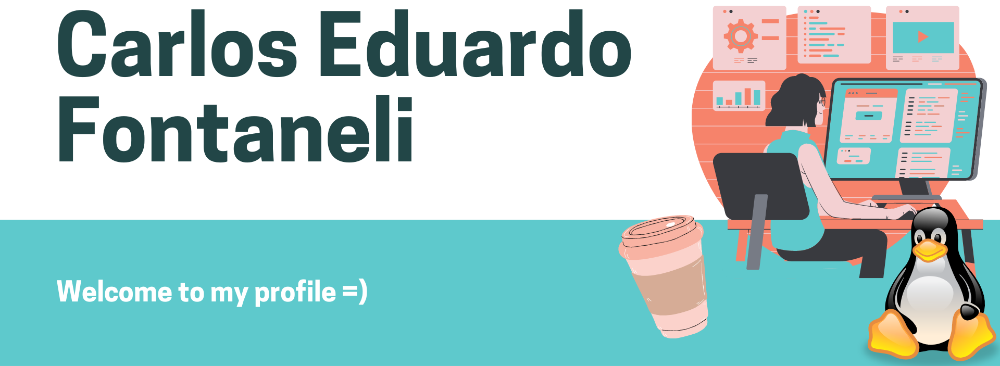

  
  <h1 align="center">Carlos Eduardo Fontaneli</h1>
  

    <strong>Machine Learning Engineer | MLOps | Computer Vision & NLP Researcher</strong>
  

  

    
    
  

## 👨‍💻 About Me

Welcome! I am a **Machine Learning Engineer** and Master’s Candidate in Computer Science at UFSCar. I specialize in bridging the gap between state-of-the-art Deep Learning research and scalable production systems.

Currently, I am working as an **ML Engineer at BigDataCorp**, orchestrating LLM-based autonomous agents for NLP data pipelines and engineering high-throughput batch-inference APIs on AWS SageMaker. My academic research focuses heavily on the efficiency and interpretability of Foundational Models, actively contrasting massive architectures like SAM (Segment Anything) against SOTA ConvNets utilizing custom-built MLOps frameworks. 

Whether I'm optimizing inference pipelines in PyTorch, developing C++ Computer Vision engines, or building comprehensive CI/CD tests for deep learning deployments, I thrive on complex problem-solving in production-scale AI.

---

## 🛠️ Tech Stack & Tools

**Machine Learning & AI:**  

**Engineering & MLOps:**  

---

## 🚀 Featured Work & Research Focus

### 🔬 [Master Thesis Draft: Medical Imaging Segmentation MLOps](https://github.com/CarlosFontaneli/masters-degree)
My Master's thesis work comparing Foundational Transformers (MedSAM, SAM) against traditional CNNs (ConvNeXt). It implements Knowledge Distillation loops to extract performance from Large Foundation models into parameter-efficient frameworks, managed entirely by a custom-built, configuration-driven YAML architecture.

### 🧠 [CNN Interpretability Toolkit](https://github.com/CarlosFontaneli/interpreting-neural-networks)
A comprehensive tool utilizing **Captum** to analyze Receptive Fields, feature attributions, and gradient flows inside complex Convolutional Neural Networks, increasing the transparency of black-box medical image detection.

### ⚙️ [Scalable NLP Microservices](https://github.com/CarlosFontaneli/data-science-projects)
Various projects deploying production-grade BERT models and Text Classification pipelines (HuggingFace Transformers, spaCy) exposed via FastAPI and Docker on AWS, integrated heavily with CI/CD action pipelines.

---

## 📈 GitHub Analytics

  
  

 

  <i>"Deploying models is easy, maintaining them and driving value is the real engineering."</i>

